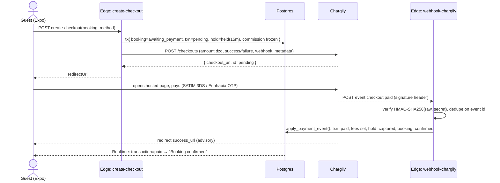
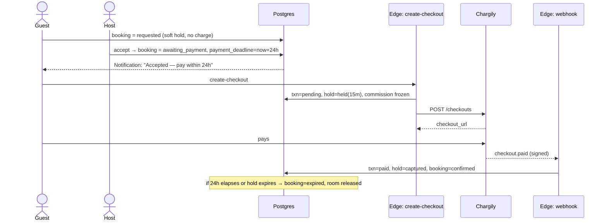
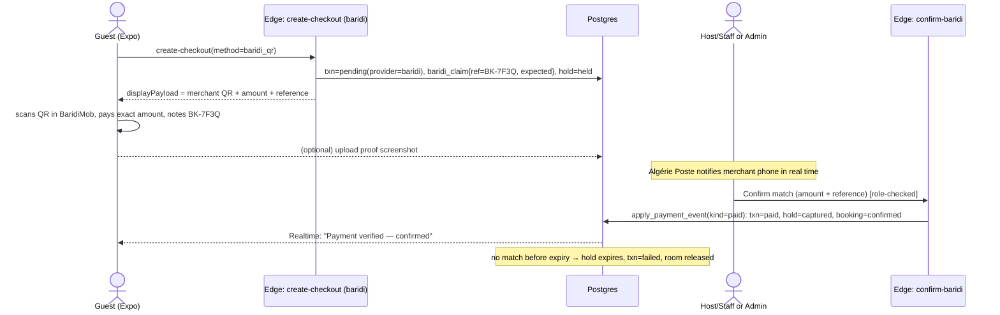

<!-- Generated by architecture-plan workflow. Subsystem: payments. Review & edit freely. -->

# Payments — Chargily Pay + Baridi Pay

I now have all the verified external details I need:

- **Base URLs**: test `https://pay.chargily.net/test/api/v2`, live `https://pay.chargily.net/api/v2`; dashboard `pay.chargily.dz`, dev docs `dev.chargily.com`
- **Auth**: `Authorization: Bearer <secret_key>`
- **Checkout**: POST `/checkouts`, params `amount`+`currency` or `items[]`, `success_url`, `failure_url`, `payment_method` (edahabia/cib), `webhook_endpoint`, `metadata`; response has `checkout_url`, `id`, `status` (pending/paid/failed/canceled/expired)
- **Webhooks**: header `signature`, HMAC-SHA256(raw body, secret) hex, constant-time compare; events `checkout.paid`, `checkout.failed`, `checkout.canceled`
- **Baridi Pay**: launched June 2025 by Algérie Poste, QR via BaridiMob, merchant needs commercial CCP + RC + tax card, real-time notification to merchant phone — **no public developer API**, confirming the assisted/reconciliation v1 approach.

I have enough to write the section.

## Payments Subsystem — Algeria-Native Gateway Layer ({{PLATFORM_NAME}})

This subsystem makes Algerian rails (Edahabia, CIB/SATIM, BaridiMob QR) first-class while keeping all app code gateway-agnostic. All money is in **DZD integer minor-units? — No**: Chargily expects DZD as a whole-dinar integer `amount` (no centimes in v1), so we store `amount_dzd integer` everywhere and never use floats for money.

### 0. Verified external facts (relied upon)

| Fact | Value | Source |
|---|---|---|
| API base (test) | `https://pay.chargily.net/test/api/v2` | Chargily v2 API ref |
| API base (live) | `https://pay.chargily.net/api/v2` | Chargily v2 API ref |
| Auth header | `Authorization: Bearer <secret_key>` | Chargily "first API request" |
| Create checkout | `POST /checkouts`, body `amount`+`currency:"dzd"` **or** `items[]`, `success_url`, `failure_url`, `payment_method` ∈ `edahabia`\|`cib`, `webhook_endpoint`, `description`, `metadata{}` | Chargily checkouts/create |
| Checkout response | `id`, `checkout_url`, `status`, `amount`, `fees`, `metadata`, `chargily_pay_fees_allocation` | Chargily checkouts/create + retrieve |
| Checkout statuses | `pending`, `paid`, `failed`, `canceled`, `expired` | Chargily checkouts/retrieve + expire |
| Webhook header | `signature` = hex `HMAC-SHA256(raw_request_body, secret_key)`; verify with constant-time compare | Chargily pay-v2/webhooks |
| Webhook events | `checkout.paid`, `checkout.failed`, `checkout.canceled` | Chargily pay-v2/webhooks |
| Server-side only | `@chargily/chargily-pay` is server-side only; secret key never client-side | Chargily JS package README |
| Baridi Pay | Launched 14 Jun 2025 by Algérie Poste; pay by scanning merchant QR in **BaridiMob**; merchant needs commercial **CCP** + RC + tax card; real-time notification to merchant phone; **no public REST/developer API** as of 2026 | poste.dz, baridimob.com |

> Implication: **Chargily is a true online gateway** (hosted page + webhooks). **Baridi Pay has no public API** → v1 is a structured *manual-confirmation / reconciliation* flow behind the same abstraction, upgradeable to an API later without touching app code.

Sources:
- [Chargily — Create a checkout](https://dev.chargily.com/pay-v2/api-reference/checkouts/create)
- [Chargily — Retrieve a checkout](https://dev.chargily.com/pay-v2/api-reference/checkouts/retrieve)
- [Chargily — Webhooks](https://dev.chargily.com/pay-v2/webhooks)
- [Chargily — Your first API request](https://dev.chargily.com/pay-v2/the-full-guide/first-api-request)
- [Chargily JS package](https://github.com/Chargily/chargily-pay-javascript)
- [Algérie Poste — Baridi Pay Pro](https://www.poste.dz/services/professional/baridi_pay_pro)
- [BaridiMob — BaridPay QR](https://www.baridimob.com/baridpay-qrcode-paiement-algerie/)

---

### 1. Internal Payment abstraction (gateway-agnostic)

One Edge Function family speaks to gateways; the rest of the app only reads/writes our own tables. The contract:

```
PaymentProvider (TS interface, server-only, in supabase/functions/_shared/payments/)
  createCheckout(input: CheckoutInput): Promise<CheckoutHandle>
  parseWebhook(raw: string, headers: Headers): Promise<NormalizedEvent>   // verifies signature
  reconcile(providerRef: string): Promise<NormalizedStatus>                // poll/retrieve
  refund(input: RefundInput): Promise<RefundResult>                        // Chargily: manual/dashboard in v1
  capabilities(): { online: boolean; webhook: boolean; autoRefund: boolean }

CheckoutInput  = { transactionId, amountDzd, method, locale, successUrl, failureUrl, metadata }
CheckoutHandle = { providerRef, redirectUrl | null, displayPayload | null }   // redirectUrl for Chargily; displayPayload (QR string) for Baridi
NormalizedEvent= { providerRef, providerEventId, kind: 'paid'|'failed'|'canceled'|'expired', amountDzd, raw }
```

Implementations: `chargilyProvider` (online=true, webhook=true, autoRefund=false), `baridiProvider` (online=false, webhook=false, autoRefund=false). `payment_method` enum maps to provider: `edahabia`,`cib` → Chargily; `baridi_qr` → Baridi.

This is the **only** place gateway names appear. `Booking`, mobile app, and dashboards reference only `Transaction.status` and `Transaction.method`.

---

### 2. Data model (Postgres / Supabase)

```sql
-- enums
create type payment_method   as enum ('edahabia','cib','baridi_qr');
create type payment_provider as enum ('chargily','baridi');
create type txn_status        as enum ('pending','paid','failed','refunded','partially_refunded');
create type txn_kind          as enum ('booking_payment','refund','payout');
create type hold_status       as enum ('held','captured','released','expired');

-- single source of truth for money movement
create table transaction (
  id                uuid primary key default gen_random_uuid(),
  booking_id        uuid not null references booking(id),
  kind              txn_kind not null default 'booking_payment',
  method            payment_method not null,
  provider          payment_provider not null,
  status            txn_status not null default 'pending',
  amount_dzd        integer  not null check (amount_dzd >= 0),     -- gross charged to guest
  commission_dzd    integer  not null default 0,                   -- platform cut, frozen at creation
  host_net_dzd      integer  not null default 0,                   -- amount_dzd - commission_dzd - gateway_fee_dzd
  gateway_fee_dzd   integer  not null default 0,                   -- Chargily fees (from webhook 'fees')
  commission_rate   numeric(5,4) not null,                         -- e.g. 0.1200, snapshot of policy at booking time
  provider_ref      text,                                          -- Chargily checkout id; Baridi reference code
  provider_status   text,                                          -- raw gateway status mirror
  expires_at        timestamptz,                                   -- payment window deadline
  paid_at           timestamptz,
  refunded_dzd      integer not null default 0,
  currency          text not null default 'dzd' check (currency='dzd'),
  metadata          jsonb not null default '{}',
  created_at        timestamptz not null default now(),
  updated_at        timestamptz not null default now()
);
create unique index uq_txn_provider_ref on transaction(provider, provider_ref) where provider_ref is not null;

-- inventory hold during pending-payment window
create table inventory_hold (
  id           uuid primary key default gen_random_uuid(),
  booking_id   uuid not null references booking(id),
  room_type_id uuid not null references room_type(id),
  date_from    date not null,
  date_to      date not null,
  units        integer not null default 1,
  status       hold_status not null default 'held',
  expires_at   timestamptz not null,
  created_at   timestamptz not null default now()
);

-- webhook dedupe / idempotency ledger
create table webhook_event (
  id              uuid primary key default gen_random_uuid(),
  provider        payment_provider not null,
  provider_event_id text not null,          -- Chargily event 'id'; for Baridi: hash(ref+status+amount)
  event_type      text not null,            -- checkout.paid etc.
  provider_ref    text,                     -- checkout id it concerns
  signature_ok    boolean not null,
  payload         jsonb not null,
  received_at     timestamptz not null default now(),
  processed_at    timestamptz,
  process_result  text,                     -- 'applied' | 'duplicate' | 'stale' | 'ignored'
  constraint uq_webhook unique (provider, provider_event_id)   -- dedupe key
);

-- manual reconciliation for Baridi (and Chargily edge cases)
create table baridi_claim (
  id            uuid primary key default gen_random_uuid(),
  transaction_id uuid not null references transaction(id),
  reference_code text not null unique,        -- short code guest puts in BaridiMob note
  expected_dzd   integer not null,
  proof_path     text,                        -- Storage path: screenshot guest uploads
  confirmed_by   uuid references auth.users(id), -- host_hotel/hotel_staff/admin who matched it
  confirmed_at   timestamptz,
  status         text not null default 'awaiting'  -- awaiting | confirmed | rejected
);

-- host payouts
create table payout (
  id            uuid primary key default gen_random_uuid(),
  host_id       uuid not null references host_profile(id),
  period_start  date not null,
  period_end    date not null,
  gross_dzd     integer not null,
  commission_dzd integer not null,
  net_dzd       integer not null,
  method        text not null,                -- 'ccp' | 'edahabia' | 'baridi'
  ccp_account   text,                         -- encrypted/masked CCP/RIP; never card PAN
  status        text not null default 'pending', -- pending | processing | paid | failed
  statement_url text,                         -- generated PDF in Storage
  reference     text,                         -- bank/post transfer ref
  created_at    timestamptz not null default now()
);
create table payout_item (
  payout_id      uuid references payout(id),
  transaction_id uuid references transaction(id),
  net_dzd        integer not null,
  primary key (payout_id, transaction_id)
);
```

**RLS posture (idiom):** `transaction`, `webhook_event`, `payout` carry `enable row level security` with **no policies granting client writes** — they are written only by Edge Functions using the **service-role key** (which bypasses RLS). Guests get a `select` policy `auth.uid() = booking.guest_id`; hosts a `select` on transactions for their properties; staff scoped by `hotel_id`. This guarantees the client can never mutate money rows even though it can read its own.

---

### 3. Chargily integration (server-side, Supabase Edge Function)

**Functions** (Deno, under `supabase/functions/`):
- `payments-create-checkout` — auth'd (verifies guest JWT), validates booking is `awaiting_payment`, computes/locks commission, calls provider, returns `{ redirectUrl }`.
- `payments-webhook-chargily` — **public** (no JWT; secured by signature), idempotent.
- `payments-reconcile` — cron + manual; retrieves checkout status for stuck `pending` txns.

**Secrets** (set via `supabase secrets set`, never in client): `CHARGILY_SECRET_KEY`, `CHARGILY_MODE` (`test`|`live`), `CHARGILY_WEBHOOK_SECRET` (= secret key per Chargily), `APP_PUBLIC_URL`.

**Create-checkout call** (shape, not full impl):
```
POST {base}/checkouts                         base = test ? pay.chargily.net/test/api/v2 : pay.chargily.net/api/v2
Authorization: Bearer ${CHARGILY_SECRET_KEY}
Content-Type: application/json
{
  "amount":  txn.amount_dzd,                  // whole DZD integer
  "currency":"dzd",
  "payment_method": method === 'cib' ? 'cib' : 'edahabia',
  "success_url": `${APP_PUBLIC_URL}/pay/return?txn=${txn.id}`,
  "failure_url": `${APP_PUBLIC_URL}/pay/return?txn=${txn.id}&failed=1`,
  "webhook_endpoint": `${SUPABASE_URL}/functions/v1/payments-webhook-chargily`,
  "description": `Booking ${booking.code}`,
  "metadata": { "transaction_id": txn.id, "booking_id": booking.id }   // echoed back in webhook
}
→ { "id":"01hj...", "checkout_url":"https://pay.chargily.dz/test/checkouts/01hj.../pay", "status":"pending", ... }
```
Store `provider_ref = id`, set `expires_at = now() + interval '15 min'`, return `checkout_url`.

**Redirect/embed (Expo + Next):**
- **Mobile (Expo):** open `checkout_url` in `expo-web-browser` `openAuthSessionAsync(checkout_url, redirectUri)` where `redirectUri` is a deep link `{{platform}}://pay/return`. Hosted page handles all card entry (SATIM 3-DS for CIB, Edahabia OTP). On dismissal we **do not trust the redirect** — truth comes from the webhook; the return screen shows a "confirming…" state and subscribes to Realtime on `transaction`.
- **Web (Next):** server action returns `checkout_url`; client does `window.location.assign(checkout_url)`. Return route `/pay/return` is a thin status poller.

**Return URLs are advisory only.** `success_url`/`failure_url` improve UX but **never** flip `Transaction.status`; only the verified webhook (or reconcile) does. This prevents a user forging a success return.

---

### 4. Baridi Pay (BaridiMob QR) — pragmatic v1

Because Algérie Poste exposes **no public API**, v1 uses a **merchant-static-QR + reference-code + confirmation** model behind the same `PaymentProvider`:

1. {{PLATFORM_NAME}} (or each `host_hotel`) registers its **commercial CCP** with Algérie Poste and obtains a BaridPay merchant QR. We store the QR image in Storage and the merchant CCP (masked) in config.
2. On choosing **Baridi Pay**, `payments-create-checkout` (provider=`baridi`) creates a `baridi_claim` with a short `reference_code` (e.g. `BK-7F3Q`) and `expected_dzd`. `CheckoutHandle.displayPayload` = the QR + amount + reference.
3. Guest scans the QR in **BaridiMob**, pays the **exact** amount, and types the `reference_code` in the transfer note; optionally uploads the confirmation screenshot (`proof_path`).
4. **Confirmation paths (abstraction stays identical):**
   - **(v1a) Host/staff-confirmed:** the merchant receives the real-time BaridiMob phone notification; `hotel_staff`/`host_individual` matches amount+note in a dashboard queue (`/dashboard/payments/baridi`) and taps **Confirm** → Edge Function `payments-confirm-baridi` (role-checked) writes a synthetic `NormalizedEvent{kind:'paid'}`.
   - **(v1b) Admin reconciliation:** `super_admin` imports the CCP statement (CSV) into `payments-reconcile`; matching by `reference_code`+amount auto-confirms.
5. Confirmation runs the **same** `markTransactionPaid()` path as a Chargily webhook → identical downstream (booking confirm, hold capture, commission freeze).

**Honest limitation surfaced in UI:** Baridi bookings show "Payment under verification — confirmed within X" and only flip to confirmed on step 4. A later upgrade (if Algérie Poste ships an API) replaces `baridiProvider.parseWebhook/reconcile` only.

---

### 5. Webhook idempotency, signature, retries, ordering

**Signature verification** (`payments-webhook-chargily`): read **raw** body bytes (not parsed JSON), compute `HMAC-SHA256(raw, CHARGILY_WEBHOOK_SECRET)` hex, constant-time compare to the `signature` header (`crypto.timingSafeEqual`). On mismatch → log `signature_ok=false`, return **403**, do not process.

**Idempotency / dedupe:** insert into `webhook_event(provider,provider_event_id)` with the unique constraint. On unique-violation → it's a retry/duplicate → return **200** with `process_result='duplicate'` and do nothing else. Chargily retries on non-2xx, so we always 200 a *seen* event.

**Apply step (single Postgres function, atomic):** `apply_payment_event(p_provider, p_ref, p_kind, p_amount, p_event_id)`:
- `select ... for update` the `transaction` by `(provider,provider_ref)`.
- **Out-of-order guard / terminal-state guard:** if `status in ('paid','refunded','partially_refunded')` and incoming is `failed`/`canceled` → mark event `process_result='stale'`, no change. (`paid` wins over a late `failed`.)
- If `paid`: set `status='paid'`, `paid_at=now()`, `gateway_fee_dzd = data.fees`, recompute `host_net_dzd`, **capture** the hold, **confirm** the booking — all in the same tx.
- Mark `webhook_event.processed_at`, `process_result='applied'`.

**Retry handling:** function is safe to run N times (dedupe + terminal guard). Transient internal failure → return 500 → Chargily redelivers → dedupe makes the eventual success exactly-once.

**Reconciliation cron** (`pg_cron` → `payments-reconcile`, every 5 min): for `transaction.status='pending' AND expires_at < now()-2min`, call Chargily **retrieve checkout**; apply true status. Covers missed webhooks and expiry. Also expires stale `inventory_hold`.

---

### 6. Inventory hold & the pending-payment window

- Availability is decremented **logically via holds**, not by mutating `availability` rows. Effective availability = `availability.units − sum(active holds)`.
- `payments-create-checkout` creates `inventory_hold(status='held', expires_at = now()+15min)` for the booking's date range in the **same transaction** as the `Transaction` row, guarded by a serializable check that effective availability ≥ requested. Two concurrent guests racing the last room → one gets a unique-constraint/`for update` loss → `409`.
- **Capture:** on `paid`, hold → `captured`; booking → `confirmed`.
- **Expire:** cron flips `held → expired` past `expires_at`; the room frees automatically; `Transaction` → `failed`; booking → `payment_expired`. Realtime pushes the freed inventory back to other searchers.

Booking lifecycle for money: `awaiting_payment → confirmed` (instant) or `requested → accepted → awaiting_payment → confirmed` (request-to-book). Booking is **never** `confirmed` without a `paid` transaction.

---

### 7. Commission, net payout, refunds

- `commission_rate` is read from policy at **checkout creation** (default platform rate e.g. **12%**, overridable per `host_profile` or `property`) and **frozen** on the `Transaction`.
- `commission_dzd = round(amount_dzd * commission_rate)`. `host_net_dzd = amount_dzd − commission_dzd − gateway_fee_dzd` (gateway fee finalized from webhook `fees`). Computed **server-side only**, stored on the row — never recomputed client-side.
- **Refunds** keyed to the property's **cancellation policy tier** (`flexible | moderate | strict`), evaluated in `refunds-quote`:
  - Flexible: 100% if ≥24h before check-in.
  - Moderate: 50% if ≥5 days.
  - Strict: 0% inside window; service-fee non-refundable.
  - Compute `refund_dzd` (full or **partial**); write a `transaction(kind='refund', amount_dzd = -refund_dzd)`; set parent `status='refunded'` or `'partially_refunded'`; `refunded_dzd += refund_dzd`.
- **Chargily refunds are not auto** in v1 (`autoRefund=false`): refund is executed via Chargily dashboard / CCP transfer by `super_admin`; the refund `transaction` tracks state; commission on the refunded portion is reversed from host net.

---

### 8. Payout flow to hosts

- **Periods:** biweekly (1–15, 16–end) per wilaya settlement convenience; only **`paid`, non-disputed, check-in elapsed + 24h** transactions are eligible.
- `payouts-generate` (cron, period close): groups eligible `transaction.host_net_dzd` by `host_id` into one `payout` + `payout_item[]`, generates a **statement PDF** (DZD, RTL Arabic / FR / EN) to Storage, status `pending`.
- **Disbursement method:** host's **CCP / Edahabia** (RIP stored masked, encrypted at rest; collected in host onboarding, **never** a card PAN). `super_admin` marks `processing → paid` with bank/post `reference`. (No automated bank API in v1 — Algerian post transfers are manual; abstraction allows a future Chargily payout API.)
- Host dashboard: `/dashboard/earnings` (statements, period, net, pending vs paid).

---

### 9. Sequence diagrams

**(1) Instant-book + card (Edahabia/CIB) via Chargily**


**(2) Request-to-book → host accepts → payment**


**(3) Baridi Pay QR (assisted confirmation v1)**


---

### 10. Non-goals (explicit)

- **Never** store raw card PAN, CVV, expiry, Edahabia/CIB credentials, or BaridiMob PIN. All card entry + 3-DS happens **inside Chargily's hosted page**; we hold only `provider_ref` and last status.
- **Never** expose `CHARGILY_SECRET_KEY` or webhook secret to Expo/Next clients — checkout creation and verification are Edge-Function-only (service role).
- No client-side computation or mutation of `commission_dzd`, `host_net_dzd`, or `Transaction.status`.
- No trust in `success_url`/`failure_url` for state — webhook/reconcile is the sole source of truth.
- v1 does **not** auto-execute Chargily refunds or bank payouts (manual, by `super_admin`); the abstraction is built so an API upgrade is a provider-only change.
- No multi-currency, no centime sub-units, no saved cards/tokenization in v1.
