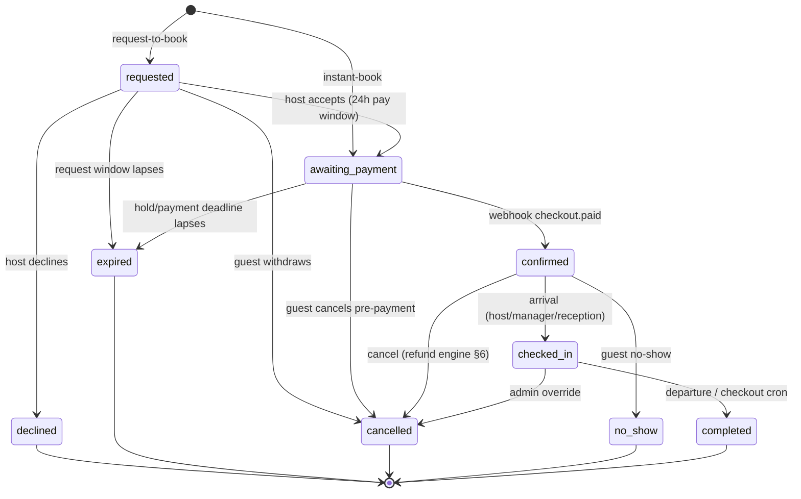

<!-- CANONICAL SPEC — single source of truth. Overrides docs 01-08 wherever they disagree.
     Generated 2026-05-31 by the reconcile→verify workflow. Brand: Dyafa (دافة). -->

# Canonical Spec — Dyafa (دافة)

> This document reconciles the 8 subsystem designs into ONE buildable specification. Where docs 01–08 disagree, **this file wins**. Locked decisions: full platform · Supabase · Expo + Next.js · Chargily-only v1 (Baridi deferred) · 10% commission (bps) · 69 wilayas · whole-dinar integer DZD.

## 1. Naming & conventions

This is the single canonical specification for **Dyafa** (دافة), an Algerian vacation-rental + hotel booking platform. It overrides every conflicting statement in the eight subsystem docs. Where a doc disagrees, **this document wins**.

**Conventions (authoritative):**

- **Table & view names:** plural `snake_case` (`profiles`, `bookings`, `transactions`). Join tables are `<owner>_<child>` plural where natural (`property_amenities`, `wishlist_items`). Master/lookup tables are plural (`wilayas`, `communes`, `property_types`, `amenities`, `cancellation_policies`).
- **Primary keys:** `id uuid primary key default gen_random_uuid()` on all transactional tables. Master tables that have a stable natural key use it (`wilayas.code smallint`, `property_types.id smallint`, `amenities.id smallint`, `cancellation_policies.tier` enum).
- **Identity mirror:** `profiles.id uuid primary key references auth.users(id) on delete cascade` (1:1 with Supabase Auth).
- **Timestamps:** every transactional table has `created_at timestamptz not null default now()`; mutable tables also have `updated_at timestamptz not null default now()` maintained by a shared `set_updated_at()` BEFORE-UPDATE trigger.
- **Money:** every monetary column is `integer`, suffix `_dzd`, `check (... >= 0)`. **No** centimes, **no** `*_minor`, **no** `bigint`, **no** `numeric` rates for money. DZD has no circulating subunit and Chargily charges whole dinars. Canonical names: `base_price_dzd`, `weekend_price_dzd`, `cleaning_fee_dzd`, `extra_guest_fee_dzd`, `price_override_dzd`, `nightly_subtotal_dzd`, `service_fee_dzd`, `discount_dzd`, `total_dzd`, `commission_amount_dzd`, `host_payout_dzd`, `gateway_fee_dzd`, `amount_dzd`, `refund_amount_dzd`, `gross_dzd`, `net_dzd`.
- **Currency lock:** every money-bearing table carries `currency char(3) not null default 'DZD' check (currency = 'DZD')` (v1 single-currency lock; relaxing to multi-currency in v2 is a constraint drop).
- **Rates:** commission stored as **basis points** `integer` (`commission_bps`), never a `numeric` fraction or a `_pct` column.
- **Soft-delete rule:** user-authored / host-authored content that must survive for history (`properties`, `reviews`, `messages`) carries `deleted_at timestamptz null`; "visible" predicates require `deleted_at is null`. Financial rows (`bookings`, `transactions`, `payouts`, `audit_log`) are **never** deleted — they transition status only. Hard delete is admin-only via RPC and audited.
- **Enums:** every `create type` appears **exactly once**, in migration `0002_enums`. No subsystem re-declares a type.
- **Locales:** localized text columns use the triplet suffix `_ar` / `_fr` / `_en` (e.g. `name_ar`, `title_fr`). Arabic is the primary/canonical locale.

### Old name → canonical name mapping

| Doc (old) name | Canonical name |
|---|---|
| `app_user` (data-model) | `profiles` |
| `user_role_grant` (data-model) | `user_roles` |
| `host_profile` | `host_profiles` |
| `hotel_staff` (per-property, auth-rls) / `host_team_members` (host-exp) | `hotel_staff` (scoped to `host_profile_id`) |
| `property` | `properties` |
| `property_image` (data-model) / `listing-photos` refs | `property_photos` |
| `property_amenity` / `room_amenity` | `property_amenities` / `room_amenities` |
| `room_type` | `room_types` |
| `availability` / `availability_calendar` | `availability` |
| `pricing_rule` / `rate_plans` | `rate_plans` |
| `booking` | `bookings` |
| `transaction` | `transactions` |
| `payment_webhook_event` / `webhook_event` | `webhook_events` |
| `payout` / `payout_item` | `payouts` / `payout_items` |
| `review` | `reviews` |
| `review.host_reply` (inline) / `review_responses` | `review_replies` (table) |
| `conversation` / `message` | `conversations` / `messages` |
| `favorite` | `favorites` |
| (new) | `wishlists` / `wishlist_items` |
| `dispute` / `dispute_message` | `disputes` / `dispute_messages` |
| `notification` | `notifications` |
| `wilaya` (singular) | `wilayas` |
| `commune` | `communes` |
| `property_type` | `property_types` |
| `amenity` | `amenities` |
| `cancellation_policy_def` | `cancellation_policies` |
| `property_review_log` | folded into `audit_log` (action `listing.*`) |
| `commission_ledger` (admin-only concept) | **removed** — commission lives on `bookings`/`transactions` snapshots + `mv_revenue_by_period` |
| `baridi_claim` | **deferred to v2** (table not created in v1) |
| `payment_method` member `chargily_edahabia`/`chargily_cib`/`baridi_pay` | `edahabia` / `cib` / `baridi_qr` |
| booking states `pending`/`pending_host`/`pending_payment`/`accepted`/`declined`/`payment_expired` | unified `booking_status` (see §3) |

---

## 2. Enum catalog

Each `create type` is defined **once** (migration `0002_enums`). These are the only enums; all subsystems consume these names verbatim. Volatile category lists (`amenities.category`, `notifications.type` extensions) may instead be `text` with a `check`, as noted.

```sql
-- Identity & roles
create type app_role            as enum ('guest','host_individual','host_hotel','hotel_staff','admin','super_admin');
create type host_kind           as enum ('individual','hotel');
create type staff_role          as enum ('reception','manager');
create type verification_status as enum ('unverified','pending','verified','rejected');

-- Property
create type property_status     as enum ('draft','pending','approved','rejected','suspended');
create type listing_kind        as enum ('single_unit','multi_room');
create type rejection_reason    as enum ('incomplete_info','poor_photo_quality','prohibited_content',
                                         'duplicate','suspected_fraud','policy_violation','other');

-- Booking (ONE canonical lifecycle — see §3)
create type booking_status      as enum ('requested','declined','awaiting_payment','confirmed',
                                         'checked_in','completed','cancelled','no_show','expired');

-- Payments (ONE method enum, ONE status enum)
create type payment_method      as enum ('edahabia','cib','baridi_qr');   -- baridi_qr RESERVED, deferred (§11)
create type payment_provider    as enum ('chargily','baridi');            -- baridi reserved, deferred
create type transaction_kind    as enum ('payment','refund','payout','chargeback');
create type transaction_status  as enum ('pending','processing','paid','failed',
                                         'refunded','partially_refunded','expired');
create type hold_status         as enum ('held','captured','released','expired');
create type payout_status       as enum ('pending','processing','paid','failed','on_hold');

-- Reviews / moderation
create type review_status       as enum ('pending','published','hidden','removed');
create type dispute_status      as enum ('open','under_review','resolved','rejected','cancelled');
create type dispute_category    as enum ('refund','no_show','property_mismatch','damage','payment','other');

-- Cancellation (drives the refund engine — see §6)
create type cancellation_tier   as enum ('flexible','moderate','strict');

-- Rate plans
create type rate_plan_kind      as enum ('base','weekend','seasonal','long_stay');
create type rate_adjust_type    as enum ('percent','absolute');

-- Conversations
create type conversation_kind   as enum ('booking','inquiry','support');

-- Merchandising
create type rail_kind           as enum ('near_you','popular_in_wilaya','beachfront','sahara_escapes',
                                         'top_rated','featured_collection','recently_viewed');

-- Notifications (text + check; high-churn, kept extensible)
-- notifications.type text not null check (type in (
--   'booking_requested','booking_accepted','booking_declined','booking_confirmed','booking_cancelled',
--   'booking_reminder','checkin_instructions','payment_succeeded','payment_failed','payment_expired',
--   'payout_paid','review_received','review_reply','message_received',
--   'listing_submitted','listing_approved','listing_rejected','listing_changes_requested','listing_suspended',
--   'dispute_opened','dispute_resolved','staff_invited'))
```

---

## 3. Booking state machine

**One** `booking_status` enum (§2) governs every booking everywhere. All legacy concepts map onto it:

| Legacy term (various docs) | Canonical state |
|---|---|
| `pending` (request-to-book, host not yet decided) | `requested` |
| `pending_host` | `requested` |
| `accepted` | `awaiting_payment` (acceptance immediately opens the payment window) |
| `declined` | `declined` |
| `pending_payment` | `awaiting_payment` |
| `payment_expired` | `expired` |
| `confirmed` | `confirmed` |
| `check_in` transition | → `checked_in` |
| `check_out` / `completed` | `completed` |
| `cancelled` | `cancelled` |
| `no_show` | `no_show` |

**Entry points.** Instant-book listings (`properties.instant_book = true`) enter at `awaiting_payment`. Request-to-book listings enter at `requested`.

### Transition table

| From | To | Trigger / actor | Guard |
|---|---|---|---|
| `requested` | `awaiting_payment` | Host/manager accepts (`accept_booking_request` RPC) | within request-expiry window; sets `payment_deadline = now() + 24h` |
| `requested` | `declined` | Host/manager declines | terminal; releases inventory hold |
| `requested` | `expired` | `expire_holds` cron | request window elapsed; releases hold |
| `requested` | `cancelled` | Guest withdraws | before host decision |
| `awaiting_payment` | `confirmed` | Chargily webhook `checkout.paid` (or reconcile) | a `paid` transaction exists; captures hold |
| `awaiting_payment` | `expired` | `expire_holds` cron | hold `expires_at` or `payment_deadline` passed; releases hold; txn → `expired` |
| `awaiting_payment` | `cancelled` | Guest cancels before paying | releases hold |
| `confirmed` | `checked_in` | Host/manager/**reception** marks arrival | on/after `check_in` date |
| `confirmed` | `cancelled` | Guest or host/manager cancels | runs refund engine (§6) per `cancellation_tier` |
| `confirmed` | `no_show` | Host/manager/**reception** marks no-show | after `check_in` date, guest never arrived |
| `checked_in` | `completed` | Host/manager/**reception** marks departure, or `complete_stays` cron at `check_out`+T | — |
| `checked_in` | `cancelled` | Admin override only | audited |

Terminal states: `declined`, `expired`, `cancelled`, `no_show`, `completed`. A booking is **never** `confirmed` without a `paid` transaction. Reviews may be written only against a `completed` booking. All transitions are enforced by a `before update` trigger on `bookings` that reads the actor's role/capability; illegal transitions `raise exception`.



---

## 4. Tables

All tables `enable row level security` and `force row level security`. `id uuid pk default gen_random_uuid()`, `created_at`, `updated_at` are implied on transactional tables unless stated. Columns below list the load-bearing fields; localized triplets shown as `_ar/_fr/_en`.

### 4.1 Identity & roles

**`profiles`** — `id uuid pk references auth.users(id) on delete cascade`, `full_name text`, `display_name text not null`, `avatar_path text` (storage path, not URL), `phone_e164 text unique` (+213), `phone_verified_at timestamptz`, `preferred_locale text not null default 'ar' check (preferred_locale in ('ar','fr','en'))`, `default_wilaya_code smallint references wilayas(code)`, `is_active boolean not null default true`, `created_at`, `updated_at`.

**`user_roles`** — `user_id uuid not null references auth.users(id) on delete cascade`, `role app_role not null`, `granted_by uuid references profiles(id)`, `granted_at timestamptz not null default now()`, `primary key (user_id, role)`. Additive grants; one account holds `guest` + a host role simultaneously. RLS and the JWT hook read from here.

### 4.2 Host & staff

**`host_profiles`** — `id uuid pk`, `owner_id uuid not null unique references auth.users(id) on delete cascade`, `kind host_kind not null`, `legal_name text`, `display_name text not null`, `bio_ar/fr/en text`, `id_doc_type text check (id_doc_type in ('cni','passport','permis'))`, `id_doc_path text` (private bucket), `rc_number text` (Registre de Commerce — hotels), `nif text` (tax id), `identity_status verification_status not null default 'unverified'`, `payout_status verification_status not null default 'unverified'`, `payout_method text check (payout_method in ('ccp','bank'))`, `payout_rib text` (20-digit Algerian RIB/CCP, stored masked/encrypted), `commission_bps_override int null check (commission_bps_override between 0 and 5000)` (nullable per-host override of platform default — see §6), `created_at`, `updated_at`.

**`hotel_staff`** — `id uuid pk`, `host_profile_id uuid not null references host_profiles(id) on delete cascade`, `user_id uuid not null references auth.users(id) on delete cascade`, `staff_role staff_role not null` (`reception` | `manager`), `is_active boolean not null default true`, `invite_token text unique`, `invited_at timestamptz`, `accepted_at timestamptz`, `unique (host_profile_id, user_id)`. **Scoped to the `host_profile`** (covers all of that host's properties) — this is the single canonical staff model; the per-property and `property_ids[]` variants are dropped. Capability matrix in §7.

### 4.3 Geography & master

**`wilayas`** — `code smallint pk` (1–69; **not** range-checked), `name_ar text not null`, `name_fr text not null`, `name_en text`, `ar_slug text`, `lat numeric(9,6)`, `lng numeric(9,6)`, `is_active boolean not null default true`. **Seed all 69** (Algeria expanded 16 Nov 2025); `is_active` lets ops gate any subset. Source dataset: S450R1/algeria-cities-2025.

**`communes`** — `id integer pk`, `wilaya_code smallint not null references wilayas(code)`, `name_ar/fr/en text`, `post_code text`. Index on `wilaya_code`.

**`property_types`** — `id smallint pk`, `slug text unique not null` (`apartment`,`villa`,`riad`,`studio`,`hotel`,`guesthouse`,`chalet`,`bungalow`,`desert_camp`,`hostel`), `name_ar/fr/en`, `kind listing_kind not null`, `icon text`, `sort_order smallint`.

**`amenities`** — `id smallint pk`, `slug text unique not null`, `category text check (category in ('general','kitchen','bathroom','safety','accessibility','outdoor'))`, `name_ar/fr/en`, `icon text`.

**`cancellation_policies`** — `tier cancellation_tier pk` (`flexible`|`moderate`|`strict`), `refund_full_until_hours int not null`, `refund_partial_pct int not null check (refund_partial_pct between 0 and 100)`, `partial_until_hours int`, `service_fee_refundable boolean not null default false`, `name_ar/fr/en text`, `description_ar/fr/en text`. **Authoritative** — drives the refund engine (§6). Seeded: flexible (100% until 24h before), moderate (50% until 5 days before / 120h), strict (0%). Service fee non-refundable in all tiers.

### 4.4 Property & rooms

**`properties`** — `id uuid pk`, `host_profile_id uuid not null references host_profiles(id) on delete restrict`, `property_type_id smallint not null references property_types(id)`, `listing_kind listing_kind not null` (denormalized at insert), `title_ar/fr/en text`, `description_ar/fr/en text`, `status property_status not null default 'draft'`, `wilaya_code smallint not null references wilayas(code)`, `commune_id integer references communes(id)`, `address_line text`, `lat numeric(9,6)`, `lng numeric(9,6)`, `geo geography(Point,4326)` (maintained from lat/lng, GiST-indexed), `geo_fuzzed geography(Point,4326)` (rounded ≈400m, public-safe — see §9), `cancellation_tier cancellation_tier not null default 'moderate' references cancellation_policies(tier)`, `checkin_time time not null default '14:00'`, `checkout_time time not null default '12:00'`, `house_rules_ar/fr/en text`, `instant_book boolean not null default false`, `currency char(3) not null default 'DZD' check (currency='DZD')`, `min_nights int not null default 1 check (min_nights >= 1)`, `max_nights int`, `cover_photo_path text`, `rating_avg numeric(3,2) not null default 0 check (rating_avg between 0 and 5)`, `review_count int not null default 0`, `submitted_at timestamptz`, `approved_at timestamptz`, `reviewed_by uuid references profiles(id)`, `rejection_reason rejection_reason`, `rejection_note text`, `published_at timestamptz`, `deleted_at timestamptz`, `created_at`, `updated_at`. Derived predicate `is_publicly_visible = (status='approved' and deleted_at is null)` used by RLS read policies. Status transitions are RPC/trigger-controlled (clients cannot set `status` directly).

**`room_types`** — `id uuid pk`, `property_id uuid not null references properties(id) on delete cascade`, `name_ar/fr/en text`, `is_default boolean not null default false`, `base_occupancy smallint`, `max_occupancy smallint not null check (max_occupancy > 0)`, `max_adults smallint`, `max_children smallint`, `bed_config jsonb not null default '[]'`, `size_sqm smallint`, `base_price_dzd integer not null check (base_price_dzd >= 0)`, `weekend_price_dzd integer check (weekend_price_dzd >= 0)`, `cleaning_fee_dzd integer not null default 0 check (cleaning_fee_dzd >= 0)`, `extra_guest_fee_dzd integer not null default 0 check (extra_guest_fee_dzd >= 0)`, `inventory_count smallint not null default 1 check (inventory_count >= 1)`, `is_active boolean not null default true`, `sort_order smallint`, `created_at`, `updated_at`. **Partial unique index** `unique (property_id) where is_default` (exactly one default unit). Single-home (`single_unit`) auto-creates exactly one default room_type with `inventory_count=1`; hotels (`multi_room`) have many.

**`property_photos`** — `id uuid pk`, `property_id uuid not null references properties(id) on delete cascade`, `room_type_id uuid references room_types(id) on delete set null`, `storage_path text not null`, `alt_ar/fr/en text`, `sort_order smallint not null default 0`, `is_cover boolean not null default false`, `created_at`.

**`property_amenities`** — `property_id uuid references properties(id) on delete cascade`, `amenity_id smallint references amenities(id)`, `primary key (property_id, amenity_id)`.
**`room_amenities`** — `room_type_id uuid references room_types(id) on delete cascade`, `amenity_id smallint references amenities(id)`, `primary key (room_type_id, amenity_id)`.

### 4.5 Availability & inventory holds

**`availability`** — `id uuid pk`, `room_type_id uuid not null references room_types(id) on delete cascade`, `date date not null`, `units_open smallint not null check (units_open >= 0)` (defaults to `room_types.inventory_count`), `price_override_dzd integer check (price_override_dzd >= 0)`, `min_stay smallint check (min_stay >= 1)`, `max_stay smallint`, `is_closed boolean not null default false`, `closed_to_arrival boolean not null default false`, `closed_to_departure boolean not null default false`, `source text not null default 'manual'` (reserved for v2 iCal/channel sync, §11), `updated_at`, `unique (room_type_id, date)`. **Availability rows store published inventory only; they are NOT mutated for transient holds** (see §5). `units_booked` is removed — effective availability is computed from confirmed bookings + active holds.

**`inventory_holds`** — `id uuid pk`, `booking_id uuid not null references bookings(id) on delete cascade`, `room_type_id uuid not null references room_types(id)`, `date_from date not null`, `date_to date not null` (`'[)'` semantics), `units smallint not null default 1 check (units > 0)`, `status hold_status not null default 'held'`, `expires_at timestamptz not null`, `created_at`. The single concurrency primitive (see §5).

**`rate_plans`** — `id uuid pk`, `room_type_id uuid not null references room_types(id) on delete cascade`, `kind rate_plan_kind not null`, `label text`, `date_start date`, `date_end date`, `weekday_mask smallint` (bitmask Sat–Fri), `min_nights_threshold smallint`, `adjust_type rate_adjust_type`, `adjust_value_dzd integer`, `price_dzd integer check (price_dzd >= 0)`, `priority smallint not null default 0`, `is_active boolean not null default true`. Resolution order at quote time: `availability.price_override_dzd` > matching `rate_plans` by priority > `room_types.weekend_price_dzd` (weekend) > `room_types.base_price_dzd`.

### 4.6 Bookings

**`bookings`** — `id uuid pk`, `code text unique not null` (e.g. `BK-2026-7F3A2`), `property_id uuid not null references properties(id) on delete restrict`, `room_type_id uuid not null references room_types(id) on delete restrict`, `guest_id uuid not null references profiles(id) on delete restrict`, `host_profile_id uuid not null references host_profiles(id)`, `check_in date not null`, `check_out date not null`, `stay_range daterange generated always as (daterange(check_in, check_out, '[)')) stored`, `nights int generated always as (check_out - check_in) stored`, `adults smallint not null default 1 check (adults > 0)`, `children smallint not null default 0`, `units smallint not null default 1 check (units > 0)`, `status booking_status not null` (no column default — set explicitly by the booking RPC: `awaiting_payment` for instant-book, `requested` for request-to-book, §3/§5), `currency char(3) not null default 'DZD' check (currency='DZD')`, `nightly_subtotal_dzd integer not null check (nightly_subtotal_dzd >= 0)`, `cleaning_fee_dzd integer not null default 0`, `extra_guest_fee_dzd integer not null default 0`, `discount_dzd integer not null default 0`, `service_fee_dzd integer not null default 0` (guest-side platform fee, non-refundable), `total_dzd integer not null check (total_dzd >= 0)`, `commission_bps int not null` (snapshot at booking), `commission_amount_dzd integer not null default 0`, `host_payout_dzd integer not null default 0`, `cancellation_tier cancellation_tier not null references cancellation_policies(tier)`, `payment_deadline timestamptz`, `cancelled_by uuid references profiles(id)`, `cancellation_reason text`, `cancelled_at timestamptz`, `refund_amount_dzd integer not null default 0`, `confirmed_at timestamptz`, `checked_in_at timestamptz`, `completed_at timestamptz`, `special_requests text`, `created_at`, `updated_at`, `check (check_out > check_in)`. Money breakdown is **snapshotted** at purchase. Client `insert` blocked (RPC-only, §5). Status changes via trigger-guarded transitions only (§3).

### 4.7 Payments & payouts

**`transactions`** — `id uuid pk`, `booking_id uuid references bookings(id) on delete set null`, `kind transaction_kind not null default 'payment'`, `method payment_method not null`, `provider payment_provider not null`, `status transaction_status not null default 'pending'`, `amount_dzd integer not null check (amount_dzd >= 0)` (gross), `commission_bps int not null`, `commission_amount_dzd integer not null default 0`, `gateway_fee_dzd integer not null default 0` (from webhook `fees`), `host_payout_dzd integer not null default 0` (= amount − commission − gateway_fee), `refunded_dzd integer not null default 0`, `currency char(3) not null default 'DZD' check (currency='DZD')`, `provider_ref text` (Chargily checkout `id`), `provider_status text` (raw mirror), `provider_payment_method text` (`edahabia`/`cib` echoed), `checkout_url text`, `success_url text`, `failure_url text`, `expires_at timestamptz`, `paid_at timestamptz`, `idempotency_key text unique`, `raw_payload jsonb not null default '{}'`, `created_at`, `updated_at`. `unique (provider, provider_ref) where provider_ref is not null`.

**`webhook_events`** (idempotent ingestion / dedupe) — `id uuid pk`, `provider payment_provider not null`, `provider_event_id text not null`, `event_type text not null` (`checkout.paid`/`checkout.failed`/`checkout.canceled`), `provider_ref text`, `signature text`, `signature_ok boolean not null`, `payload jsonb not null`, `transaction_id uuid references transactions(id)`, `processed_at timestamptz`, `process_result text check (process_result in ('applied','duplicate','stale','ignored'))`, `received_at timestamptz not null default now()`, `unique (provider, provider_event_id)`. Dedupe key — see §8 for the event-id fallback.

**`payouts`** — `id uuid pk`, `host_profile_id uuid not null references host_profiles(id)`, `status payout_status not null default 'pending'`, `gross_dzd integer not null`, `commission_amount_dzd integer not null`, `net_dzd integer not null`, `currency char(3) not null default 'DZD' check (currency='DZD')`, `method text check (method in ('ccp','bank'))`, `destination_rib text` (masked), `period_start date not null`, `period_end date not null`, `reference text`, `statement_path text` (PDF in Storage), `paid_at timestamptz`, `failure_reason text`, `created_at`, `updated_at`.

**`payout_items`** — `payout_id uuid references payouts(id) on delete cascade`, `booking_id uuid references bookings(id)`, `net_dzd integer not null`, `primary key (payout_id, booking_id)`.

### 4.8 Reviews & replies

**`reviews`** — `id uuid pk`, `booking_id uuid not null unique references bookings(id) on delete cascade` (one review per stay), `property_id uuid not null references properties(id) on delete cascade`, `author_id uuid not null references profiles(id)`, `target text not null check (target in ('property','guest'))`, `status review_status not null default 'pending'`, `overall smallint not null check (overall between 1 and 5)`, `cleanliness smallint check (cleanliness between 1 and 5)`, `accuracy smallint`, `communication smallint`, `location smallint`, `value smallint`, `checkin smallint`, `comment_text text`, `published_at timestamptz`, `deleted_at timestamptz`, `created_at`, `updated_at`. **No inline `host_reply` columns.**

**`review_replies`** — `id uuid pk`, `review_id uuid not null unique references reviews(id) on delete cascade` (**one reply per review**, enforced by `unique`), `host_profile_id uuid not null references host_profiles(id)`, `author_id uuid not null references profiles(id)`, `body text not null`, `created_at`, `updated_at`. The single canonical reply mechanism.

### 4.9 Messaging

**`conversations`** — `id uuid pk`, `kind conversation_kind not null`, `property_id uuid references properties(id) on delete set null`, `booking_id uuid references bookings(id) on delete set null`, `guest_id uuid not null references profiles(id)`, `host_profile_id uuid not null references host_profiles(id)`, `last_message_at timestamptz`, `created_at`, `unique (booking_id) where booking_id is not null`.

**`messages`** — `id uuid pk`, `conversation_id uuid not null references conversations(id) on delete cascade`, `sender_id uuid not null references profiles(id)`, `body text`, `attachment_path text`, `read_at timestamptz`, `deleted_at timestamptz`, `created_at`. Immutable except `read_at` and `deleted_at` (sender soft-flag). Realtime subscribed by `conversation_id`.

### 4.10 Favorites & wishlists

**`wishlists`** — `id uuid pk`, `user_id uuid not null references profiles(id) on delete cascade`, `name text not null`, `is_default boolean not null default false`, `cover_photo_path text`, `created_at`, `updated_at`. Partial unique index `unique (user_id) where is_default` (one default unnamed list per user). The "heart" toggle adds to the default list; named lists are user-created.

**`wishlist_items`** — `wishlist_id uuid references wishlists(id) on delete cascade`, `property_id uuid references properties(id) on delete cascade`, `added_at timestamptz not null default now()`, `primary key (wishlist_id, property_id)`.

**`favorites`** (compatibility view, not a base table) — defined as `select user_id, property_id, added_at from wishlist_items wi join wishlists w on w.id = wi.wishlist_id where w.is_default`. Keeps the "simple favorites" read-path while wishlists are the storage of record. (Heart-state queries hit this view.)

### 4.11 Merchandising

**`featured_collections`** — `id uuid pk`, `slug text unique not null`, `title_ar/fr/en text`, `subtitle_ar/fr/en text`, `cover_photo_path text`, `is_active boolean not null default true`, `starts_at timestamptz`, `ends_at timestamptz`, `sort_order smallint not null default 0`, `created_at`, `updated_at`.

**`collection_items`** — `collection_id uuid references featured_collections(id) on delete cascade`, `property_id uuid references properties(id) on delete cascade`, `sort_order smallint not null default 0`, `primary key (collection_id, property_id)`.

**`promo_banners`** — `id uuid pk`, `image_path text not null`, `title_ar/fr/en text`, `body_ar/fr/en text`, `target_url text`, `is_active boolean not null default true`, `starts_at timestamptz`, `ends_at timestamptz`, `sort_order smallint not null default 0`, `created_at`, `updated_at`.

**`home_rails`** — `id uuid pk`, `key text unique not null`, `kind rail_kind not null`, `title_ar/fr/en text`, `wilaya_code smallint references wilayas(code)` (for `popular_in_wilaya`), `collection_id uuid references featured_collections(id)` (for `featured_collection`), `is_active boolean not null default true`, `sort_order smallint not null default 0`, `created_at`, `updated_at`. The customer home screen reads active rails ordered by `sort_order`; merchandising changes need no app release.

### 4.12 Moderation, disputes & audit

**`disputes`** — `id uuid pk`, `booking_id uuid not null references bookings(id) on delete cascade`, `opened_by uuid not null references profiles(id)`, `against uuid references profiles(id)`, `category dispute_category not null`, `status dispute_status not null default 'open'`, `description text`, `resolution_note text`, `resolved_by uuid references profiles(id)`, `resolved_at timestamptz`, `refund_amount_dzd integer not null default 0`, `created_at`, `updated_at`.

**`dispute_messages`** — `id uuid pk`, `dispute_id uuid not null references disputes(id) on delete cascade`, `sender_id uuid not null references profiles(id)`, `body text`, `evidence_path text`, `created_at`.

**`notifications`** — `id uuid pk`, `user_id uuid not null references profiles(id) on delete cascade`, `type text not null` (check-constrained, §2), `title_ar/fr/en text`, `body_ar/fr/en text`, `data jsonb` (deep-link payload), `read_at timestamptz`, `sent_push boolean not null default false`, `created_at`.

**`audit_log`** (single canonical, append-only — union of both proposals) — `id bigint generated always as identity primary key`, `actor_id uuid not null references profiles(id)`, `actor_role app_role`, `action text not null` (e.g. `listing.approve`, `booking.force_refund`, `payout.release`, `user.ban`, `settings.update`, `report.export`), `target_type text not null`, `target_id uuid`, `before jsonb`, `after jsonb`, `reason_code text`, `reason text`, `ip text`, `user_agent text`, `created_at timestamptz not null default now()`. Written **only** by SECURITY DEFINER functions; `before update or delete` trigger raises; no client write policy. Absorbs the old `property_review_log` (status transitions logged as `listing.*`).

### 4.13 Settings & analytics views

**`platform_settings`** (single-row config) — `id smallint primary key default 1 check (id = 1)`, `commission_bps int not null default 1000 check (commission_bps between 0 and 5000)` (10% default), `payout_period text not null default 'biweekly'`, `payout_hold_hours int not null default 24`, `request_expiry_hours int not null default 24`, `payment_window_minutes int not null default 15`, `geo_fuzz_meters int not null default 400`, `feature_flags jsonb not null default '{}'`, `updated_at`. **One** representation of commission (default `commission_bps`); per-host override is `host_profiles.commission_bps_override`. No `commission_pct`, no `commission_ledger`, no `numeric` rate.

**Analytics materialized views** (refreshed by `pg_cron` with `REFRESH MATERIALIZED VIEW CONCURRENTLY`; all money integer DZD):

| MV | Grain | Columns | Feeds |
|---|---|---|---|
| `mv_daily_metrics` | per day | `day, bookings_count, gmv_dzd, commission_dzd, new_users, completed_bookings` | admin overview tiles + time-series |
| `mv_conversion_funnel` | per day | `day, listing_views, booking_starts, bookings_paid, conversion_pct` | conversion KPI |
| `mv_top_destinations` | per wilaya/commune, rolling 30/90d | `wilaya_code, commune_id, bookings, gmv_dzd, window` | top-destinations chart |
| `mv_host_performance` | per host | `host_profile_id, listings_active, bookings, gmv_dzd, avg_rating, cancellation_rate, response_rate` | host performance table (admin) + host `HostPerformanceScreen` |
| `mv_revenue_by_period` | day/week/month | `period, period_start, gmv_dzd, commission_dzd, host_net_dzd` | revenue report + growth chart |

Supporting derived objects: `property_review_stats` materialized view (six category averages + `computed_overall` + `review_count` per property) feeds the property detail page; `properties.rating_avg`/`review_count` denormalized columns (trigger-maintained) back search ranking.

---

## 5. Inventory & concurrency

**One** model: a dedicated **`inventory_holds`** table with TTL. **`availability` rows are never mutated for transient holds.** This replaces the data-model's advisory-lock + `units_booked` counter and the "held availability span" idea.

**Effective availability** for a `room_type_id` on a `date`:

```
effective_units(room_type_id, date) =
    availability.units_open
  − (count of CONFIRMED/CHECKED_IN/COMPLETED booking-units overlapping date)
  − (sum of inventory_holds.units WHERE status='held' AND expires_at > now() AND date ∈ [date_from, date_to))
```

A room is bookable for a span iff `effective_units >= requested_units` for **every** night and no night has `is_closed`, with `closed_to_arrival` checked on `check_in` and `closed_to_departure` on `check_out`. `daterange '[)'` makes back-to-back stays (checkout day = next checkin day) non-colliding.

**`create_booking(property_id, room_type_id, check_in, check_out, adults, children, units)` RPC** (SECURITY DEFINER, `search_path` pinned), one transaction:

1. Resolve `host_profile_id`, `listing_kind`, `instant_book`, `cancellation_tier`, and `commission_bps` (= `coalesce(host_profiles.commission_bps_override, platform_settings.commission_bps)`).
2. Take a transaction-level advisory lock keyed on `room_type_id`: `pg_advisory_xact_lock(hashtextextended(room_type_id::text, 0))` — serializes concurrent attempts on the same room type so the effective-availability check is race-free.
3. For each night in `[check_in, check_out)`: assert `not is_closed` and `effective_units >= units`. On failure → raise (maps to HTTP 409).
4. Compute the price snapshot in whole DZD (resolution order from §4.5), `service_fee_dzd`, `commission_amount_dzd = round(taxable * commission_bps / 10000)`, `host_payout_dzd`.
5. Insert `bookings` row: `status = instant_book ? 'awaiting_payment' : 'requested'`; set `payment_deadline` accordingly.
6. Insert `inventory_holds(status='held', expires_at = now() + (platform_settings.payment_window_minutes for awaiting_payment; request_expiry_hours for requested))` for the span.
7. Return `booking_id`.

**Capture:** on `checkout.paid`, the matching hold → `captured`, booking → `confirmed`. The confirmed booking is now what consumes inventory (term 2 of the formula); the hold is no longer counted.

**Expiry:** `expire_holds` cron flips `held → expired` past `expires_at`, sets the booking to `expired` (or `declined`/withdrawn as applicable), transaction → `expired`, and Realtime pushes freed inventory to searchers.

**Single-unit integrity backstop:** for `room_types.inventory_count = 1`, an exclusion constraint on confirmed bookings guarantees no overlap even if logic regresses:

```sql
create extension if not exists btree_gist;
alter table bookings add constraint bookings_single_unit_no_overlap
  exclude using gist (room_type_id with =, stay_range with &&)
  where (status in ('awaiting_payment','confirmed','checked_in')
         and room_type_id in (select id from room_types where inventory_count = 1));
```

(For multi-unit hotels, the advisory-lock + effective-availability check in `create_booking` is authoritative; legitimate overlaps across units are allowed.)

---

## 6. Money, commission & refunds

**Money:** integer whole-dinar everywhere (`*_dzd`), `currency = 'DZD'` locked. No centimes, no `bigint`, no floats. Display divides nothing — formats the integer with Western Arabic numerals + `دج` (ar) / `DZD` (fr/en).

**Commission (one representation):**
- Platform default: `platform_settings.commission_bps = 1000` (10%).
- Per-host override: `host_profiles.commission_bps_override` (nullable).
- Effective rate at booking time: `coalesce(host_profiles.commission_bps_override, platform_settings.commission_bps)`, **snapshotted** onto `bookings.commission_bps` and `transactions.commission_bps`.
- `commission_amount_dzd = round(taxable_base * commission_bps / 10000.0)` computed server-side, frozen on the booking/transaction. `host_payout_dzd = amount_dzd − commission_amount_dzd − gateway_fee_dzd`. Never recomputed client-side; historical reports stay stable when the rate changes.

**Refund engine (table-driven, no hardcoded constants):** on cancellation, `quote_refund(booking_id)` (used by the cancel RPC and the admin force-refund Edge Function) reads `cancellation_policies` for the booking's `cancellation_tier`:

- Compute `hours_before = extract(epoch from (check_in_at − now()))/3600`.
- If `hours_before >= refund_full_until_hours` → refund = 100% of refundable base.
- Else if `partial_until_hours is not null and hours_before >= partial_until_hours` → refund = `refund_partial_pct`% of refundable base.
- Else → 0%.
- **Refundable base = `total_dzd − service_fee_dzd`** (service fee is non-refundable in every tier; `service_fee_refundable = false`).
- Seeded tiers: **flexible** (`refund_full_until_hours = 24`, no partial), **moderate** (`refund_full_until_hours = 120`, `refund_partial_pct = 50`, `partial_until_hours = 120` → 50% until 5 days before, else 0), **strict** (`refund_full_until_hours = ∞`/large, `refund_partial_pct = 0`).

The refund writes a `transactions(kind='refund', amount_dzd = refund_amount_dzd)`, sets the parent transaction `status = 'refunded'` (full) or `'partially_refunded'` (partial), increments `refunded_dzd`, reverses the commission on the refunded portion from host net, and stamps `bookings.refund_amount_dzd`. **Chargily refunds are not automated in v1** — `super_admin` executes the actual disbursement via the Chargily dashboard or CCP transfer; the refund transaction tracks state. Editing `cancellation_policies` changes refund behavior immediately (no code change).

---

## 7. RLS naming map

All tables `enable row level security` + `force row level security`. Admin/super_admin get a `for all using (is_staff())` bypass per table; `super_admin`-only actions additionally check `has_role('super_admin')`. Helper functions (SECURITY DEFINER, `search_path = ''`, `stable`):

- `auth.has_role(r text) → boolean` — `auth.jwt() -> 'app_roles' ? r`.
- `auth.is_staff() → boolean` — `has_role('admin') or has_role('super_admin')`.
- `auth.my_host_id() → uuid` — `nullif(auth.jwt() ->> 'host_id','null')::uuid`.
- `auth.can_act_on_property(p_property_id uuid, p_min_role staff_role) → boolean` — true if caller owns the property's `host_profile` (`properties.host_profile_id = my_host_id()`), OR is an `active` `hotel_staff` row for that `host_profile_id` whose `staff_role >= p_min_role` (manager > reception). **Single** capability helper consumed by all dashboards.

JWT claims are injected by the **Custom Access Token Hook** (`custom_access_token_hook`): `app_roles text[]` (array, from `user_roles`) and `host_id uuid` (from `host_profiles.owner_id`). Refresh session client-side after a role grant.

| Final table | Policies (summary) |
|---|---|
| `profiles` | SELECT/UPDATE self (`id = auth.uid()`); admin all. |
| `user_roles` | SELECT self; writes via `grant_host_role`/staff RPCs only (super_admin). `supabase_auth_admin` SELECT for the hook. |
| `host_profiles` | SELECT self/owner + admin; UPDATE owner (verification fields read-only to host); `supabase_auth_admin` SELECT for the hook. |
| `hotel_staff` | SELECT/INSERT/UPDATE by owning host (`host_profile_id` maps to `my_host_id()`); staff read own row; admin bypass. |
| `wilayas`,`communes`,`property_types`,`amenities`,`cancellation_policies` | public SELECT to `anon, authenticated`; writes `super_admin` only. |
| `properties` | SELECT: `is_publicly_visible` to anon/auth via the **public view** (geo-masked, §9) OR `can_act_on_property(id,'reception')` OR `is_staff()`. INSERT: host role + `host_profile_id = my_host_id()`. UPDATE: `can_act_on_property(id,'manager')` and `status <> 'suspended'`; `status` column changes blocked for clients (moderation RPC only). DELETE: owner only while `status='draft'`. |
| `room_types` | SELECT via parent visibility; write `can_act_on_property(property_id,'manager')` (reception cannot edit pricing). |
| `availability` | SELECT via parent visibility; write `can_act_on_property(property_id,'reception')` (reception may block/unblock dates, not pricing). |
| `rate_plans` | write `can_act_on_property(property_id,'manager')`. |
| `property_photos`,`property_amenities`,`room_amenities` | write `can_act_on_property(property_id,'manager')`. |
| `bookings` | SELECT: `guest_id = auth.uid()` OR `can_act_on_property(property_id,'reception')`. INSERT: `with check(false)` (RPC-only). UPDATE: trigger-guarded transitions; guest may cancel own within window; reception may `checked_in`/`completed`/`no_show`; cancel-with-refund requires manager (enforced in `cancel_booking` RPC). |
| `transactions`,`webhook_events`,`payouts`,`payout_items` | client writes `with check(false)` (Edge Functions/service role only). SELECT: guest sees own booking's txns; host/manager see own properties' txns & payouts (`can_act_on_property(...,'manager')`); reception excluded from financials. |
| `reviews` | public SELECT for reviews on approved properties; INSERT by guest with a `completed` booking (one per booking); UPDATE/DELETE author within edit window. |
| `review_replies` | INSERT/UPDATE by host (`host_profile_id = my_host_id()` or manager); one per review (unique); public SELECT alongside the review. |
| `conversations`,`messages` | participant-scoped (`guest_id`/host or staff of the host); message INSERT only as `sender_id = auth.uid()` and member; no hard update/delete. |
| `wishlists`,`wishlist_items` | per-user (`user_id = auth.uid()` / parent wishlist owner) for all CRUD. `favorites` view inherits. |
| `featured_collections`,`collection_items`,`promo_banners`,`home_rails` | public SELECT where active/in-window; writes admin only. |
| `disputes`,`dispute_messages` | INSERT by connected parties (`opened_by = auth.uid()`); SELECT opener + admin (hosts don't see reporter identity on reports); UPDATE admin only. |
| `notifications` | per-user SELECT (`user_id = auth.uid()`), UPDATE only `read_at`; inserts via triggers/Edge Functions (`with check(false)`). |
| `audit_log` | SELECT `is_staff()`; no INSERT/UPDATE/DELETE policy (definer-only writes); reject-trigger on update/delete. |
| `platform_settings` | SELECT `authenticated`; UPDATE `super_admin` only (audited). |

**Realtime** publication: `messages`, `bookings`, `notifications`, `availability` — RLS authorizes each streamed row against the subscriber's JWT, so no separate channel ACL.

---

## 8. Payments integration

**Chargily Pay v2 only for v1.** Edahabia + CIB, automated, webhook-driven, sandbox-tested. Baridi (`baridi_qr`) is reserved in the enum but has **no flow/UI** in v1 (§11).

**Base URL (one shared constant)** — `supabase/functions/_shared/chargily.ts`:

```ts
export const CHARGILY_BASE =
  Deno.env.get('CHARGILY_MODE') === 'live'
    ? 'https://pay.chargily.net/api/v2'
    : 'https://pay.chargily.net/test/api/v2';
```

This corrects the auth-rls `api.chargily.com/v2` reference and the `pay.chargily.dz` host (that is only the hosted-checkout page domain returned in `checkout_url`, never the API base). Auth: `Authorization: Bearer ${CHARGILY_SECRET_KEY}`. Secrets (`supabase secrets set`, server-only, never `EXPO_PUBLIC_`/`NEXT_PUBLIC_`): `CHARGILY_SECRET_KEY`, `CHARGILY_MODE`, `CHARGILY_WEBHOOK_SECRET` (= secret key per Chargily), `APP_PUBLIC_URL`.

**Checkout creation** — Edge Function `payments-create-checkout` (verifies guest JWT; validates booking is `awaiting_payment`; computes/locks commission in the same transaction as the hold):

```
POST {CHARGILY_BASE}/checkouts
Authorization: Bearer ${CHARGILY_SECRET_KEY}
{
  "amount": txn.amount_dzd,                 // whole DZD integer
  "currency": "dzd",                        // the only supported code
  "payment_method": method === 'cib' ? 'cib' : 'edahabia',
  "success_url": `${APP_PUBLIC_URL}/pay/return?txn=${txn.id}`,
  "failure_url": `${APP_PUBLIC_URL}/pay/return?txn=${txn.id}&failed=1`,
  "webhook_endpoint": `${SUPABASE_URL}/functions/v1/payments-webhook-chargily`,
  "description": `Booking ${booking.code}`,
  "locale": profile.preferred_locale,
  "metadata": { "transaction_id": txn.id, "booking_id": booking.id }
}
→ { "id": "...", "checkout_url": "https://pay.chargily.dz/.../pay", "status": "pending", ... }
```

Store `provider_ref = id`, `expires_at = now() + platform_settings.payment_window_minutes`, return `checkout_url`. Mobile opens it via `expo-web-browser` `openAuthSessionAsync(checkout_url, '{{scheme}}://pay/return')`; web does `window.location.assign`. **Return URLs are advisory only** — they never flip `transactions.status`.

**Webhook + signature + idempotency** — Edge Function `payments-webhook-chargily` (public, no JWT, secured by signature):

1. Read the **raw** body bytes. Compute `HMAC-SHA256(raw, CHARGILY_WEBHOOK_SECRET)` hex; constant-time compare to the `signature` header. Mismatch → log `signature_ok=false`, return **403**.
2. **Dedupe key:** insert into `webhook_events(provider='chargily', provider_event_id, ...)` with the `unique(provider, provider_event_id)` constraint. **Event-id source:** use Chargily's body `id` if present; the documented payload is `{ id, type, data:{...} }`. **Fallback (if a stable per-event id is absent):** `provider_event_id = encode(sha256(provider_ref || ':' || event_type || ':' || amount_dzd || ':' || provider_status), 'hex')` — deterministic so retries collide. On unique-violation → return **200** with `process_result='duplicate'`, do nothing else.
3. **Apply atomically** via `apply_payment_event(provider, provider_ref, kind, amount_dzd, event_id)`: `select ... for update` the transaction by `(provider, provider_ref)`. Terminal/out-of-order guard — if status already in (`paid`,`refunded`,`partially_refunded`) and incoming is `failed`/`canceled` → mark `stale`, no change (`paid` wins a late `failed`). On `paid`: set `status='paid'`, `paid_at=now()`, `gateway_fee_dzd = data.fees`, recompute `host_payout_dzd`, **capture** the hold, **confirm** the booking, insert a `notifications` row. Mark `webhook_events.process_result='applied'`.
4. Always return **200** for a seen event; transient internal failure → **500** so Chargily redelivers (dedupe makes it exactly-once).

**Reconciliation** — `payments-reconcile` (pg_cron every 5 min): for `transactions.status='pending' and expires_at < now() − 2min`, call Chargily **retrieve checkout** and apply the true status; also drives `expire_holds`. Covers missed webhooks.

**Sandbox testing (deliverable):** run against `CHARGILY_MODE=test` (`.../test/api/v2`); local webhook delivery via `supabase functions serve` + a cloudflared/ngrok tunnel registered as the test `webhook_endpoint`. A recorded test-mode `checkout.paid` run is kept as defense backup; the apply path has a Vitest unit test (valid/invalid/tampered signature) plus a pgTAP assertion that `apply_payment_event` is idempotent.

**Non-goals:** never store card PAN/CVV/credentials; never ship the secret/webhook key to clients; never compute `commission_amount_dzd`/`host_payout_dzd`/status client-side; no trust in success/failure URLs; no centimes; no saved cards.

---

## 9. Geo privacy

Exact coordinates are **never** exposed to anon or pre-booking users. Two columns on `properties`: `geo` (exact, host-entered) and `geo_fuzzed` (rounded ≈`platform_settings.geo_fuzz_meters`, default **400m**, maintained by a trigger that snaps `lat/lng` to a coarse grid before building the point).

- **Public read path** is a view `properties_public` that selects all listing columns **except** `geo`, `lat`, `lng`, `address_line`, exposing only `geo_fuzzed` (+ a derived approximate `lat/lng` rounded to 3 decimals). The public RLS SELECT policy on `properties` is replaced for anon/pre-booking reads by granting SELECT on `properties_public`; the base-table policy returning exact geo requires `is_staff()` OR `can_act_on_property(id,'reception')` OR a **confirmed booking** by the caller.
- **Exact coordinates** (`geo`, `lat`, `lng`, `address_line`) become readable to a guest only once they hold a booking on that property in status `confirmed`/`checked_in`/`completed` — enforced by a SELECT policy on the base table: `exists (select 1 from bookings b where b.property_id = properties.id and b.guest_id = auth.uid() and b.status in ('confirmed','checked_in','completed'))`.
- The customer `PropertyLocationScreen` renders the fuzzed radius pre-booking and the exact pin post-confirmation. EXIF GPS is stripped from uploaded photos by the `listing-image-process` Storage trigger.

---

## 10. Edge functions & storage

**Edge functions** (Deno, `supabase/functions/`; shared code in `_shared/{cors.ts, supabaseAdmin.ts, chargily.ts, hmac.ts}`):

| Function | Trigger | Auth | Purpose |
|---|---|---|---|
| `create-booking` | client POST | user JWT | SECURITY DEFINER tx: effective-availability re-check + advisory lock, price snapshot, insert `bookings` + `inventory_holds`; returns booking id. |
| `payments-create-checkout` | client POST | user JWT | Validates `awaiting_payment`, locks commission, calls Chargily, stores `transactions`, returns `checkout_url`. |
| `payments-webhook-chargily` | Chargily → public URL | HMAC `signature` | Verify, dedupe on `webhook_events`, `apply_payment_event` (paid → capture hold + confirm booking), idempotent. |
| `payments-reconcile` | pg_cron + manual | service role | Retrieve checkout for stuck `pending`; apply true status; drive expiry. |
| `expire_holds` | pg_cron | service role | Release expired holds; transition bookings to `expired`; txn → `expired`; Realtime frees inventory. |
| `complete_stays` | pg_cron | service role | `checked_in`/`confirmed` past checkout → `completed`. |
| `accept-booking-request` / `cancel-booking` | client POST | user JWT (role-checked) | Request-to-book accept/decline; host/guest cancel with refund engine (§6). |
| `payouts-generate` | pg_cron (period close) | service role | Aggregate eligible `transactions.host_payout_dzd` per host into `payouts` + `payout_items`; generate statement PDF. |
| `analytics-refresh` | pg_cron | service role | `REFRESH MATERIALIZED VIEW CONCURRENTLY` for the five MVs + `property_review_stats`. |
| `admin-actions` | admin/super_admin POST | role-gated JWT | Privileged mutations (moderate listing, verify host, suspend/ban user, force-cancel/refund, release payout, master-data & merchandising writes, role grants); writes `audit_log` in the same unit. |
| `listing-image-process` | Storage trigger on `listing-photos` | service role | Resize/blur variants, **strip EXIF GPS**, validate mime/size. |
| `verify-phone` | client POST | user JWT | Best-effort phone OTP wrapper (stretch — see below); rate-limited. |

**Storage buckets** (canonical names; path = first segment is the owner for RLS):

| Bucket | Public? | Path convention | Policy |
|---|---|---|---|
| `listing-photos` | public-read | `{host_profile_id}/{property_id}/{uuid}.webp` | INSERT only into own folder by a host/manager (`(storage.foldername(name))[1] = my_host_id()::text`); public SELECT. |
| `avatars` | public-read | `{user_id}/avatar.webp` | INSERT own folder; public SELECT. |
| `kyc-docs` | **private** | `{user_id}/{uuid}` | INSERT own folder; SELECT `is_staff()` only, via short-TTL signed URL from an admin RPC. |
| `payout-statements` | **private** | `{host_profile_id}/{payout_id}.pdf` | written by `payouts-generate` (service role); SELECT owner/manager + admin via signed URL. |

(The doc conflict `property-photos` vs `listing-photos` is resolved in favor of **`listing-photos`**; all upload policies and `property_photos.storage_path` use this bucket and the `{host_profile_id}/{property_id}/` path.)

**Phone OTP note (+213):** **email verification is the hard gate** for host go-live (a `before update` trigger blocks `properties.status → approved` unless `host_profiles.identity_status='verified'`, which itself requires a confirmed email). Phone OTP is **best-effort / stretch** — provider deliverability to +213 (Mobilis/Djezzy/Ooredoo A2P, via Twilio Verify / Vonage / WhatsApp fallback) is unconfirmed; `profiles.phone_verified_at` is recorded when it works but is **not** a launch gate.

**Fonts (one pair, locked in `packages/design-tokens`):** **Plus Jakarta Sans** (Latin, OFL) + **IBM Plex Sans Arabic** (OFL); display headlines use **Fraunces** (OFL) on Latin and IBM Plex Sans Arabic 700 on Arabic. **Inter, Roboto, Cairo, Tajawal, Arial, system-ui are BANNED** from repo assets. Expo (`expo-font`) and both Next apps (`next/font`) import the **same** token package — `assets/fonts/` ships only the three permitted families. (Corrects repo-tooling's `Cairo/Inter` and customer-app's "or Cairo/Tajawal" hedge.)

---

## 11. Deferred to v2

- **Baridi Pay automation** — `baridi_qr` payment_method and `baridi` provider are reserved in the enums and the `PaymentProvider` gateway abstraction is preserved, but **no Baridi flow, UI, `baridi_claim` table, or reconciliation queue ships in v1** (Algérie Poste exposes no public API as of 2026). Adding it later is a provider-implementation + UI change only, no schema/enum migration.
- **iCal / channel-manager sync** (Booking.com/Airbnb import-export) — reserve `availability.source` + a future `ical_feeds` table; not built.
- **Loyalty / wallet / promo codes** — `bookings.discount_dzd` exists as a placeholder; `promo_codes`/`wallet_ledger` tables deferred.
- **Multi-currency** — `currency char(3) check (currency='DZD')` everywhere; relaxing is a constraint drop + FX table.
- **Multi-room single booking** (one reservation spanning several room_types) — current `bookings` is one room_type per row; v2 adds a `booking_groups` parent + line items.
- **Automated Chargily refunds & automated bank/CCP payouts** — v1 is operator-driven (`super_admin` via dashboard/transfer); the abstraction allows a future payout API.
- **Pinned physical-room assignment** (`unit_index` per physical room) — deferred; v1 tracks units as a count only.
- **Phone OTP as a hard gate** — deferred until a +213 SMS route is provisioned; email verification gates host go-live in v1.
- **Tourist tax / TVA** — no tax column in v1; add a `taxes_dzd` column + rule engine when a rule exists.
